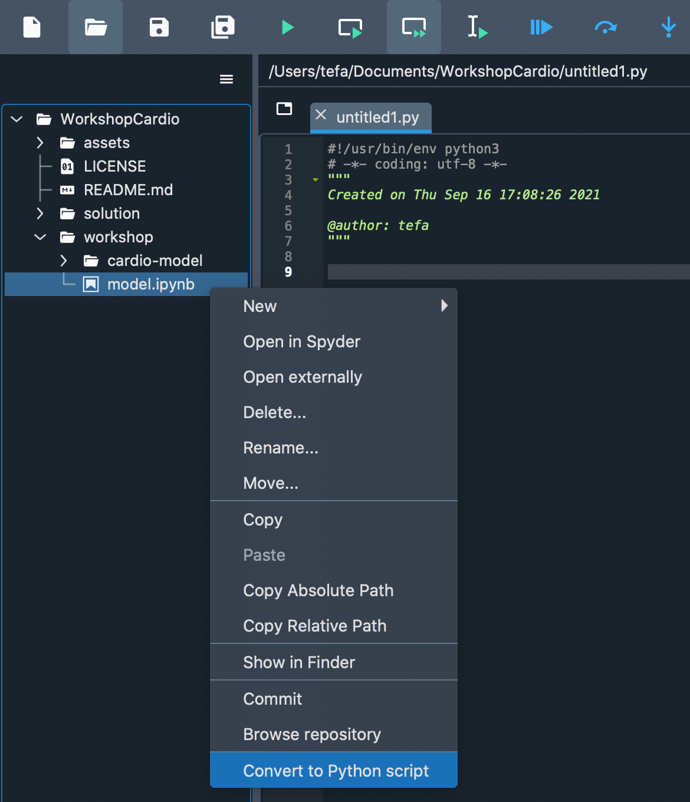

# Converting Jupyter notebooks to reproducible python packages using Spyder

The main objective of this workshop is to explore the transition from a Jupyter notebook to a Python package using Spyder as IDE. To do this, we will work on understanding a optimization model to determine the compliance of a cardiovascular graft using Python libraries like `Sympy` and `NumPy`. The model was first developed in a Jupyter notebook, but now we want to distribute it as a program with parameters that can be used by any system terminal. For more information on this particular optimization model, there is more information in the available slides [here](https://docs.google.com/presentation/d/1MVDgDDHtH28vK0E7XlmTc0fjpsFH-ikkjo24Z4yX5W4/edit?usp=sharing)

After completing this workshop you will be able to achieve the following 5 activities,

1. Open and edit a project in Spyder.
2. Run the Code Analysis using Spyder.
3. Synthesize blocks of code in a python function.
4. Add arguments to a python script from the system terminal
5. Run a model with different arguments

## Table of content
1. [Prerequisites](#pre)
2. [First steps](#pripasos)
3. [Opening the project](#recognizing)
4. [Exploring the notebook](#exp)
5. [Converting the notebook into a Python script](#conv)
6. [Organizing our new script](#org)
7. [Adding arguments from the terminal to our script](#arg)
8. [Defining a main function](#main)
9. [Final code cleaning using pep8 or black linting](#clean)
10. [Your turn](#turn)

## Prerequisites <a name="pre"> </a>

### Creating Anaconda environment

Anaconda installation is required to create a development environment. To install this program please go to this [link](https://www.anaconda.com/products/individual) and download the installer for your operating system. Once installed, open a system terminal and create a Python 3.8 environment called `t-workshop` as indicated by the following instructions,

```
conda create -n t-workshop -c conda-forge python = 3.8
conda activate t-workshop
```

### Installing Spyder

Additionally, we will need to install the Spyder editor, we recommend the Spyder installers for Windows or Mac users available [here](https://github.com/spyder-ide/spyder/releases/tag/v5.1.4). Spyder can also be downloaded from anaconda from a system terminal by following the instruction,

```
conda install spyder -c conda-forge
```

A new way of installation for Spyder involves the use of maxiconda, available in this [link](https://www.maxiconda.org). It brings installers for all the OS systems and will let you install packages and manage environments with support to ARM processors. It uses mamba and the conda-forge channel under the hook and it is developed for final end users.

### Installing packages

The necessary libraries for this workshop are `sympy` and `numpy`, which can be installed from a terminal as follows,

```
conda install numpy matplotlib scikit-learn pandas -c conda-forge
```

**Note:** If you used one of the installers for Mac or Windows of Spyder terminal please follow the instructions to connect our new environment to the Spyder editor available [here](https://docs.spyder-ide.org/current/faq.html#using-existing-environment).

### Use Binder

If you had problems installing Spyder locally, you can follow this workshop by clicking the button below. This will open a tab in your browser with Spyder and all the necessary packages and materials for it.

[](https://github.com/spyder-ide/binder-environments/tree/women-in-bds-conference)

**Note:** Please note that this is a temporary session, which means that all work done in it will be lost as soon as the Binder tab is closed.

## First steps <a name="pripasos"> </a>
If you are familiar with `git`, please clone the following repository,

```
git clone https://github.com/steff456/WorkshopTransposones
```

Otherwise, the contents of this workshop can be downloaded from this [link](https://drive.google.com/file/d/1KsWO3GjdjBGjprOx0uJKw2YIeNTbjinW/view?usp=sharing).

Once the material is downloaded, start a jupyter notebook server by typing in your system terminal `jupyter notebook` and open the `model.ipynb` notebook, found inside the `workshop` directory. Also, open Spyder using the shortcut available on your computer. Open the workshop in Spyder as a project using the menu `Project> Open Project` and selecting the `cardio-model` folder.

## Opening the project <a name="recognizing"> </a>
Once we open the project in Spyder, we will find two folders under the same level. The `workshop` folder contains the files that we are going to modify today. Inside the this folder we will have one directory called `cardio-model` and an IPython Notebook called `model.ipynb`. While, the `solution` folder contains the solution of the workshop that we will carry out today.

## Exploring the notebook <a name="exp"> </a>
Our main goal is to convert the notebook into a small Python package that we can distribute and our users can run from their terminal. In order to accomplish this goal, we need to first understand what our notebook contains. As well, we are interested in determining how we are using it to run and obtain the desired results.

When we open the `model.ipynb` we can go through the cells and check that they are running and we have the expected output, which is 4 values for each one of the desired compliances. We can also go through to make sure that all the code we want to distribute is there.

## Converting the notebook into a Python script <a name="conv"> </a>
Given that the notebook is running as expected, we can go ahead to Spyder and give right click in the notebook name in the projects pane and select the option `Convert to Python script`, as shown below,



This action will result in a new file where all the notebook cells are converted into Spyder cells, separating code using the `# In` comment. You can note it because it will change the background color of the complete cell.

## Organizing our new script <a name="org"> </a>
Normally, notebooks are used to prototype fast Python code and explore data in an easy way. This means that we usually don't follow any code standard and our code can get disorganized really fast. As we want to distribute this code for other people to use and hopefully build on top of it, we want it to be as clear and easy to follow as we can.

It can be difficult to know from where to start if this is one of the first packages you are developing. We are going to take advantage of the Code Analysis plugin in Spyder to get some help for that. The first step is to open this plugin by clicking in Spyder's main menu `View > Panes > Code Analysis`. It will appear automatically with the focus on the actual file we are working on. The main objective of this plugin is to score our code and let us know which conventions, refactoring, warnings and errors are present for us to fix.

We are going to start with the high priority messages thrown by the tool, which are the error messages. Note that if you are seeing any error that states `Unable to import X`, where `X` is any library name, it generally means that your current environment doesn't have that library installed. To fix this, you will need to close Spyder, install the missing dependency from the system terminal using `conda` or `pip` and then reopen Spyder.

**Note:** The example file shouldn't throw any error or refactoring messages.

Next, we are going to fix the warning messages. In this case, we will just have one that states that we have a reimport in our script. Given that it is a duplicate, we will just simply remove that line from our script. In here we can note that the code analysis tool will not refresh itself alone.

The next part of the report involves the convention messages. This type of information normally involves fixes that don't represent any error or warning on Python, but are not in the standard of code. We will go through each one of them and fix it depending on what the message states. A list of the messages that appear with its meaning is shown,

- **Trailing whitespace:** One or multiple whitespace were left at the end of the line
- **Superfluous parenthesis:** Unnecessary parenthesis after a keyword like `if`, `while`, `for`, etc.
- **Trailing newlines:** More than one trailing space at the end of the file.
- **Missing module docstring:** No documentation of the module was found in the top of the file.
- **Invalid name:** Constants should be completely in upper case, while variables should be in lower case.
- **Wrong import position:** Imports should be on the top of the file, after the module docstring.

Once we resolve the amount of warnings where we are happy with, we are going to start refactoring our code.

## Adding arguments from the terminal to our script <a name="arg"> </a>

The first thing we see in our notebook is a couple of code blocks commented which redefine the variables `RS`, `RP`, `KR` and `KL` depending on the state of the heart. The model is able to determine the compliance coefficients of the graft. This is an excellent example of parameters that can be defined by the user on the terminal.

After studying our code, we can determine that it will be useful to have two parameters overall for the package, one that chooses the state of the heart and another to vary the volume of blood in the system. For this we can define that our first parameter is going to be called `mode` and the other one is going to be `vol`.

Using the Python standard library `argparse`, we are going to add this to our script. First, we need to import this library on the top of our file,

```
import argparse
```

Then, we wil create an argument parser object using the library,

```
parser = argparse.ArgumentParser(description='Compliance calculation')
```

With the parser object created, we can start to add the expected arguments to our program, which will be the `mode` as a string and `vol` as a float,

```
parser.add_argument('--mode', default='healthy',
                    help='Case for changing the parameters value.')

parser.add_argument('--vol', default=5, help='Total volume of blood')
```

Afterwards, we will define a variable to gather the information the parser acquires from the terminal command,

```
args = parser.parse_args()
```

Now, we will use an `if` block to define the values of the constants we are going to use depending on the `mode` taking into account corner cases where the mode doesn't exist,

```
if args.mode == 'healthy':
    RS = 17.5
    RP = 1.79
    KR = 2.8
    KL = 1.12
elif args.mode == 'heart-failure':
    RS = 6.82
    RP = 1.36
    KR = 4.72
    KL = 9.5
elif args.mode == 'hypertension':
    RS = 40.5
    RP = 3.21
    KR = 3
    KL = 1.7
else:
    raise RuntimeError("The mode is not valid.")
```

Next, we will save the information of the volume in another constant,

```
V = float(args.vol)
```

We can now try running this code from a system terminal with the flags `--mode` and `--vol`, if they are not defined by the user, they will adopt their default value.

```
python main.py --mode hypertension --vol 5.2
```

The program should run smoothly with the parameters and we can delete the previously commented code and the first cell from our script.

## Defining a main function <a name="main"> </a>

Now that we are able to get parameters as input for our script, we want to define a function as the main entry point of our program. For this, we are going to use the standard Python call for defining a `main`.

In the bottom of our script we are going to add the following instructions,

```
if __name__ == '__main__':
    main()
```

Please note that we are going to create a function called `main`, but in here multiple instructions can happen with any name that you want to put it. This is useful because now it is clear from where our script is going to start running.

Now, we need to define who is going to be that `main` function we are referencing in the instruction. As we already understand the structure of our prototype code, we have multiple blocks that are in charge of different stages needed for the model. We have the definition of variables, equations, volumes, pressures and objective function. Then, we calculate the partial derivatives of the objective function and start running a simulation with a determined number of iterations. We can see very clearly that this can be separated into two different functions, one in charge of the definitions and other in charge of the simulation.

First, we are going to move the definition code into a new function called `create_def`,

```
def create_def():
    # Definition of variables
    Csa = Symbol('Csa')
    Csv = Symbol('Csv')
    Cpa = Symbol('Cpa')
    Cpv = Symbol('Cpv')

    # Definition of equations
    Tsa = Csa/KR+Csa*RS
    Tsv = Csv/KR
    Tpa = Cpa/KL+Cpa*RP
    Tpv = Cpv/KL

    Tsum = Tsa+Tsv+Tpa+Tpv

    # Volumes
    Vsa = Tsa*V/Tsum
    Vsv = Tsv*V/Tsum
    Vpa = Tpa*V/Tsum
    Vpv = Tpv*V/Tsum
    Vsum = Vsa+Vsv + Vpa+Vpv
    Vtot = lambdify((Csa,Csv,Cpa,Cpv),
                Vsum)

    # Pressures
    Psa = Tsa*V/ (Csa*Tsum)
    Psv = Tsv*V/ (Csv*Tsum)
    Ppa = Tpa*V/ (Cpa*Tsum)
    Ppv = Tpv*V/ (Cpv*Tsum)

    # Objective Function
    f_obj = V/(Tsum)
    f = lambdify((Csa, Csv, Cpa, Cpv), f_obj)

    # Partial derivatives of objective function
    partial = derive_by_array(f_obj, (Csa, Csv, Cpa, Cpv))
    grad = lambdify((Csa, Csv, Cpa, Cpv),
                partial)

    return grad, Vtot, f
```

Then, we are going to define a function called `run_simulation` that is going to run the simulation by minimizing the gradient we calculated previously,

```
def run_simulation(grad, Vtot, f):
    n = 10000

    # Generate random values for init Cpa, Cpv, Csa, Csv
    x = np.random.rand(4)

    min_val = 5000000
    min_x = x

    while n > 0:
        # Check all x are positive
        for val in x:
            if val < 0:
                val = abs(val)

        # Check the volume restriction
        act_v = Vtot(x[0],x[1],x[2],x[3])

        if act_v != V:
            y = V*np.ones(4)
            diff = np.abs(np.subtract(x,y))
            val, idx = min((val,idx) for (idx,val) in enumerate(diff))
            x[idx] = val

        # Calculate gradient given the points
        g = grad(x[0],x[1],x[2],x[3])

        # Calculate the value of the objective function
        act = f(x[0],x[1],x[2],x[3])

        if act< min_val:
            min_val = act
            min_x = x

        # Modify the actual value depending the gradient
        val, idx = max((val, idx) for (idx, val) in enumerate(g))
        x[idx] = abs(x[idx]+val)
        n = n - 1

    return min_x
```

With these two functions defined, we can go ahead and define our `main` function. In there we will call the two previously defined functions and we will print the result,

```
def main():
    grad = create_def()
    min_x = run_simulation(grad, Vtot, f)
    print(' Csa: {} \n Csv: {} \n Cpa: {} \n Cpv: {} \n'.format(
              min_x[0], min_x[1], min_x[2], min_x[3]))
```

Now, we are able to test our code once again and see that it is running as before.

## Final code cleaning using pep8 and docstring linting <a name="clean"> </a>

There's a couple of code style linting and formatting that can be used nowadays to format the code. Everyone decides which one they like best, and even which rules to use and which ones don't. If we go to `Preferences > Completion and linting` you will find a lot of tabs with multiple options that are available for use during your development with Spyder.

Today we will go to the `Code style and formatting` tab and check the box to `Enable code style linting`. As we want to have our script as polished as possible, we are also going to the `Docstring style` tab and check the box to `Enable docstring style linting`. Once we have those two, we can hit the button Apply and close the preferences dialog.

Automatically, we can see a lot of warnings in the editor on our script. This are all linting issues that we want to resolve to have our code compliant with the formatting styles. Please remember that you can decide which ones to apply and which ones leave as they are, these warnings are just a guide.

The basics for having a really nice written code is to have a docstring in all the functions. This docstring can be as simple or complicated as you need, but it is important to document what each function is doing, and if you want you can even describe the expected input and outputs so developers can use it in the future.

We will focus to add this into our script, in the way that our functions look something like,

```
def create_def():
    """Define variables, equations and objective function."""
```

```
def run_simulation(grad, Vtot, f):
    """Minimize the objective function to get the compliance values."""
```

```
def main():
    """Run the program."""
```

Afterwards you can resolve the pep8 issues you can have. Normally this will take into account white spaces in an empty line, parenthesis not properly aligned, or white spaces around operators. This may take some time, but this will help to the overall readability of the script. You can also re-run the code analysis tool to see if there's something else you will like to change that will improve the quality of the code after the refactoring made.

Now you will be able to share this project with your users. Please remember that we always recommend using any IDE for creating code. If the tool offers any linting experience, we highly recommend it because then you will not need to be refactoring your code once it is done and working, but you can start writing it to reduce this overhead.

## Your turn <a name="turn"> </a>
I will like you to test yourself to try to add a new argument of number of iterations to the program. You will have to add a new argument to the parser, and decide how to refactor the code to use that value inside the `run_simulation` function. There's no right way to do it, because there's more than a couple of ways to achieve it. The solution demonstrates one of them.
